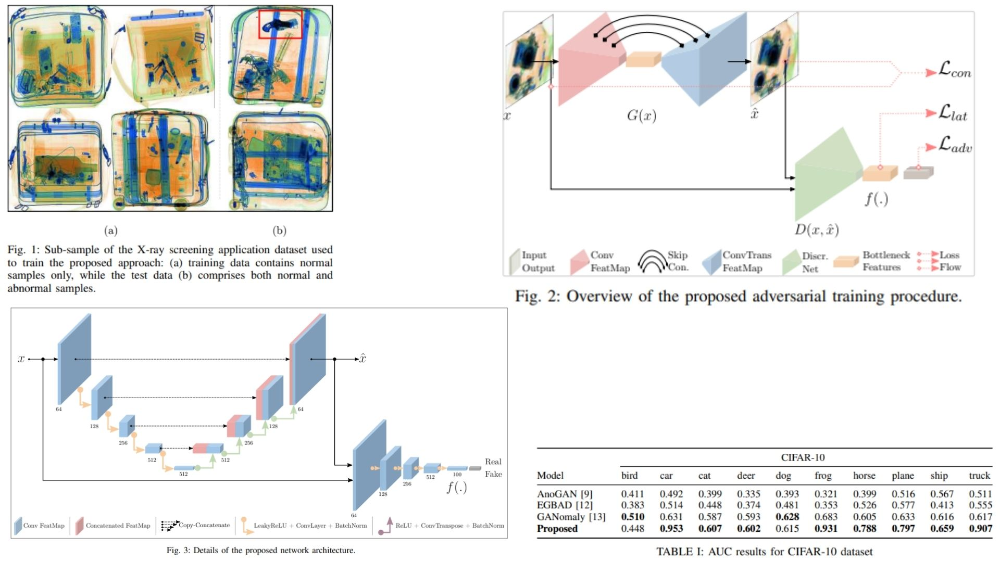

# 📡 Video-Anomaly-SkipGAN – Adversarial Autoencoder for Anomaly Detection

This repository provides a **theoretical PyTorch replication** of the **Skip-GANomaly framework for video anomaly detection**.  
It emphasizes understanding reconstruction-based anomaly detection with **skip connections and adversarial training**, without benchmarking for SOTA.

- Learning **normal image and latent patterns** from videos 🍄  
- Anomaly detection via **adversarial + contextual + latent losses** 🖥  
- Explicit use of **skip-connected autoencoders** with a discriminator 🦋  
- Modular design for ablation, analysis, and extension 🐣

**Paper reference:** [Skip-GANomaly: Skip Connected and Adversarially Trained Encoder-Decoder for Anomaly Detection](https://arxiv.org/pdf/1901.08954) 🐥

---

## 🌟 Overview – Skip-Connected Adversarial Autoencoder



The core idea:

- Train the model **exclusively on normal data**.  
- A **generator (encoder + decoder with skip connections)** reconstructs input images.  
- A **discriminator** distinguishes real vs. generated images and extracts latent features.  
- **High anomaly scores** arise when reconstruction or latent representation fails.

Pipeline steps:

1. Encode input image $x$ into latent vector $z$:  
   $$z = G_E(x)$$
2. Decode latent vector to reconstruct input:  
   $$\hat{x} = G_D(z)$$
3. Extract latent features from discriminator for both $x$ and $\hat{x}$:  
   $$f(x), f(\hat{x})$$
4. Compute **three complementary losses**:
   - **Adversarial loss:** realism of reconstructed images.  
   - **Contextual loss:** similarity between $x$ and $\hat{x}$ in image space.  
   - **Latent loss:** similarity between $f(x)$ and $f(\hat{x})$.  
5. Combine weighted losses to train generator and discriminator jointly.

During inference:

- Compute **reconstruction score** $R(x)$ and **latent score** $L(x)$  
- Combine into final anomaly score:  
  $$hat{A}(x) = \lambda R(x) + (1-\lambda) L(x)$$  
- Higher $$hat{A}(x) $$ → more likely an anomaly.

---

## 🧠 Model Learning

The generator:

- Captures **spatial features** of normal samples with skip-connected encoder-decoder.  
- Preserves **multi-scale details** via skip connections.  

The discriminator:

- Distinguishes **real vs. fake images**.  
- Extracts **latent representations** for computing latent loss.  

Together, the network **learns a joint representation in image + latent space**, making abnormal patterns detectable without labels 🍭.

---

## 📦 Repository Structure

```bash
Video-Anomaly-SkipGAN/
├── src/
│   ├── layers/
│   │   ├── conv_block.py          # Conv2D + activation (+ optional pooling)
│   │   ├── deconv_block.py        # ConvTranspose2D decoder blocks
│   │   └── utils_layers.py        # weight init & helpers
│   │
│   ├── blocks/
│   │   ├── encoder_block.py       # Skip-connected encoder
│   │   ├── decoder_block.py       # Skip-connected decoder
│   │   └── discriminator_block.py # Discriminator layers
│   │
│   ├── model/
│   │   ├── generator.py           # Wraps encoder + decoder
│   │   ├── discriminator.py
│   │   └── skip_ganomaly.py       # Full model assembly
│   │
│   ├── losses/
│   │   ├── adversarial_loss.py
│   │   ├── contextual_loss.py
│   │   └── latent_loss.py
│   │
│   └── config.py
│
├── images/
│   └── figmix.jpg
│
├── requirements.txt
└── README.md
```
---


## 🔗 Feedback

For questions or feedback, contact: [barkin.adiguzel@gmail.com](mailto:barkin.adiguzel@gmail.com)
